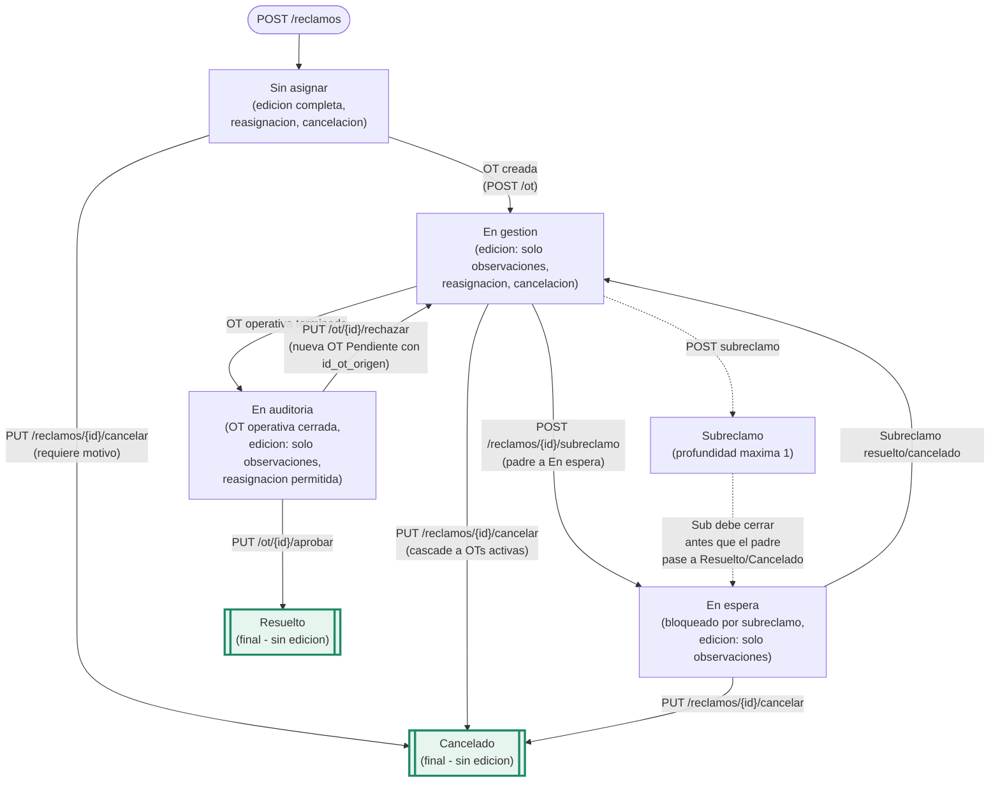
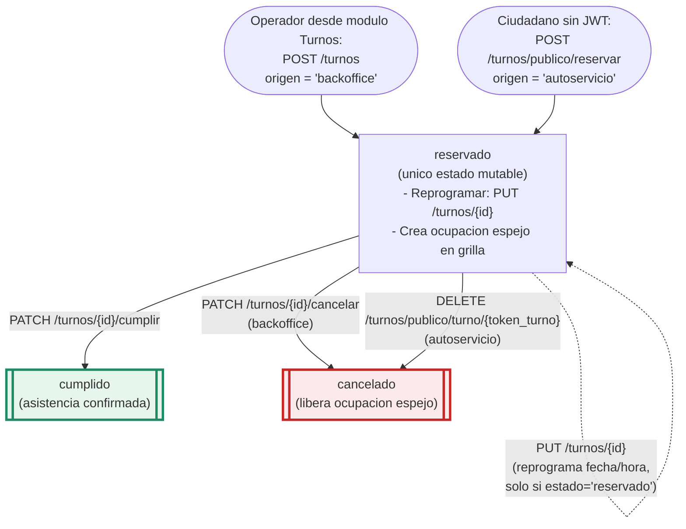
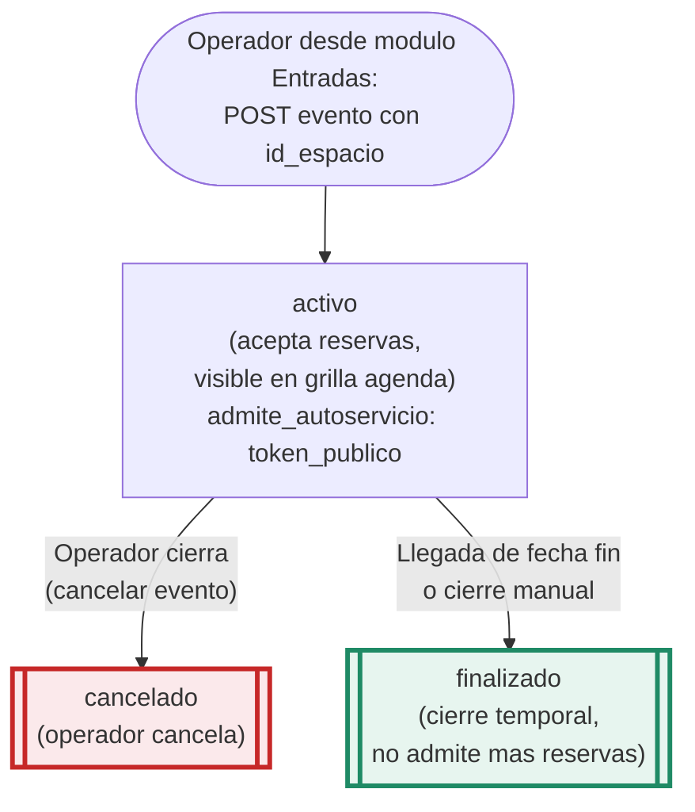

# Flujos operativos ZARIS ZGE

Diagramas Mermaid de los flujos transaccionales reales del sistema. Cada diagrama refleja exactamente los estados definidos en la base de datos (CHECK constraints / tablas catálogo) y los endpoints implementados en el backend.

Fuente única de verdad:
- Estados de reclamo: CHECK `ck_reclamo_estado` + tabla `estado_reclamo`.
- Estados de OT: tabla `estado_ot` (seeds aplicados 2026-05-12).
- Estados de turno: CHECK del campo `turnos.estado` (mig 45).
- Estados de evento y reserva: tablas `estado_evento` y `estado_reserva` (mig 31).

---

## 1. Flujo de Reclamo

Alta en "Sin asignar". Cancelación permitida hasta "En auditoría" excluida (Sin asignar / En gestión / En espera). Reasignación permitida en todos los estados no finales. Edición completa solo en "Sin asignar"; edición parcial (solo `observaciones`) en estados intermedios; estados finales rechazan edición con 422.



**Reglas clave:**
- **Sub-reclamo** se crea con `POST /reclamos/{id}/subreclamo`. Profundidad maxima 1: si el padre ya tiene `id_reclamo_padre`, la API rechaza.
- Mientras exista un sub-reclamo activo (`Sin asignar`, `En gestion`, `En espera`, `En auditoria`), el reclamo padre **no puede** pasar a `Resuelto` ni `Cancelado`. El backend valida antes de aplicar el cambio de estado.
- Cambios de estado quedan registrados como filas append-only en `reclamo_historial`.

---

## 2. Flujo de Orden de Trabajo (OT)

Estados de la tabla `estado_ot`: `Pendiente`, `En gestion`, `En espera`, `Terminada`, `Cancelada`.

```mermaid
flowchart TD
    AltaSup([Supervisor crea OT:<br/>POST /ot o POST /ot/con-agenda])
    AltaRechazo([Rechazo de auditoria:<br/>PUT /ot/{id}/rechazar<br/>genera nueva OT con id_ot_origen])

    AltaSup --> Pendiente
    AltaRechazo --> Pendiente

    Pendiente["Pendiente<br/>(sin asignar a agente,<br/>o asignada sin tomar)"]
    EnGestion["En gestion<br/>(agente trabajando)"]
    EnEspera["En espera<br/>(bloqueada por dependencia)"]
    Terminada[["Terminada<br/>(operativa cerrada -><br/>reclamo a En auditoria)"]]
    Cancelada[["Cancelada<br/>(cascade del reclamo padre)"]]

    Pendiente -->|"Agente toma:<br/>PUT /ot/{id}/tomar"| EnGestion
    Pendiente -->|"PUT /ot/{id}/estado"| EnGestion
    Pendiente -->|"Cancelacion del reclamo padre"| Cancelada

    EnGestion -->|"PUT /ot/{id}/estado"| EnEspera
    EnGestion -->|"PUT /ot/{id}/estado"| Terminada
    EnGestion -->|"Cancelacion del reclamo padre"| Cancelada

    EnEspera -->|"PUT /ot/{id}/estado"| EnGestion
    EnEspera -->|"Cancelacion del reclamo padre"| Cancelada

    %% Auditoria sobre Terminada
    Terminada -->|"Auditor aprueba:<br/>PUT /ot/{id}/aprobar<br/>(reclamo -> Resuelto)"| FinAprobado([Reclamo a Resuelto])
    Terminada -->|"Auditor rechaza:<br/>PUT /ot/{id}/rechazar"| AltaRechazo

    classDef finalNode stroke:#1f8a65,stroke-width:3px,fill:#e7f5ef
    classDef finalCancel stroke:#c62828,stroke-width:3px,fill:#fbe9eb
    class Terminada finalNode
    class Cancelada finalCancel
```

**Operaciones:**
- **Alta:** Supervisor crea OT desde la bandeja de reclamos (`POST /ot` simple, o `POST /ot/con-agenda` que ademas planifica ocupacion en la grilla).
- **Tomar:** Agente toma una OT no asignada con `PUT /ot/{id}/tomar`.
- **Cambio de estado:** `PUT /ot/{id}/estado` con el `id_estado_ot` destino.
- **Aprobar (auditoria):** `PUT /ot/{id}/aprobar` -> reclamo pasa a `Resuelto`.
- **Rechazar (auditoria):** `PUT /ot/{id}/rechazar` -> crea nueva OT en `Pendiente` con `id_ot_origen` apuntando a la rechazada.
- **Cancelar:** No tiene endpoint dedicado; se produce en cascada cuando el reclamo padre se cancela.

---

## 3. Flujo de Turnos

Estados del CHECK en `turnos.estado`: `reservado`, `cumplido`, `cancelado`. Origen via columna `turnos.origen` (`backoffice` o `autoservicio`, mig 46).



**Notas operativas:**
- Cada turno mantiene una **ocupacion espejo** en `ocupaciones` (`tipo='turno'`, `tipo_recurso='agente'`) para aparecer en la grilla del modulo Agenda. La sincronizacion se gestiona desde `routes/turnos.py`.
- **Reprogramar** solo es valido si el estado actual es `reservado`; el handler actualiza turno + ocupacion en una transaccion.
- **Cumplir** solo modifica `turno.estado` (la ocupacion queda como historico en la grilla).
- **Cancelar** modifica `turno.estado` y hace soft-delete de la ocupacion espejo (libera el slot).
- El **autoservicio** usa `token_turno UUID` (no enumerable) en lugar de JWT.

---

## 4. Flujo de Entradas (eventos con reserva)

Estados de evento (`estado_evento`): `activo`, `finalizado`, `cancelado`. Estados de reserva (`estado_reserva`): `reservada`, `asistio`, `cancelada`.

### 4a. Ciclo de vida del evento



### 4b. Ciclo de vida de la reserva

```mermaid
flowchart TD
    AltaBO([Operador via ReservaModal<br/>reusado de Agenda<br/>(backoffice)])
    AltaAS([Ciudadano sin JWT:<br/>/autoservicio/:tokenPublico<br/>POST reserva con token])

    AltaBO --> Reservada
    AltaAS --> Reservada

    Reservada["reservada<br/>(QR generado:<br/>EVT{id}-RES{id}-{ts})"]
    Asistio[["asistio<br/>(acreditada)"]]
    CanceladaRes[["cancelada"]]

    Reservada -->|"PATCH /reservas/{id}/asistio<br/>(manual desde lista)"| Asistio
    Reservada -->|"POST /reservas/acreditar-qr<br/>(escaneo del QR fisico)"| Asistio
    Reservada -->|"PATCH /reservas/{id}/cancelar<br/>(backoffice)"| CanceladaRes
    Reservada -->|"Cancelacion via token publico<br/>(autoservicio)"| CanceladaRes

    %% Cascade desde el evento
    EvtCancelado([Evento pasa a 'cancelado'])
    EvtCancelado -->|"Reservas activas<br/>se cancelan en cascada"| CanceladaRes

    classDef finalOk stroke:#1f8a65,stroke-width:3px,fill:#e7f5ef
    classDef finalCancel stroke:#c62828,stroke-width:3px,fill:#fbe9eb
    class Asistio finalOk
    class CanceladaRes finalCancel
```

**Notas operativas:**
- **Entradas no tiene tablas propias.** Reusa `eventos` + `evento_reservas` del backend de Agenda. Un "evento con entradas" es un `evento` con `id_espacio` no nulo (filtro `con_espacio=true` en `GET /agenda/eventos`).
- El **autoservicio publico** se habilita seteando `evento.admite_autoservicio=true`; el backend genera `token_publico UUID` y la pagina `/autoservicio/:tokenPublico` permite reservar sin JWT.
- El **QR de acreditacion** es un identificador opaco (no URL). Se escanea con lector fisico y se acredita via `POST /reservas/acreditar-qr` con body `{qr_codigo}`.
- La gestion de reservas en el modulo Entradas **reutiliza el `ReservaModal` del modulo Agenda** (cross-module import valido por compartir entidad backend).
